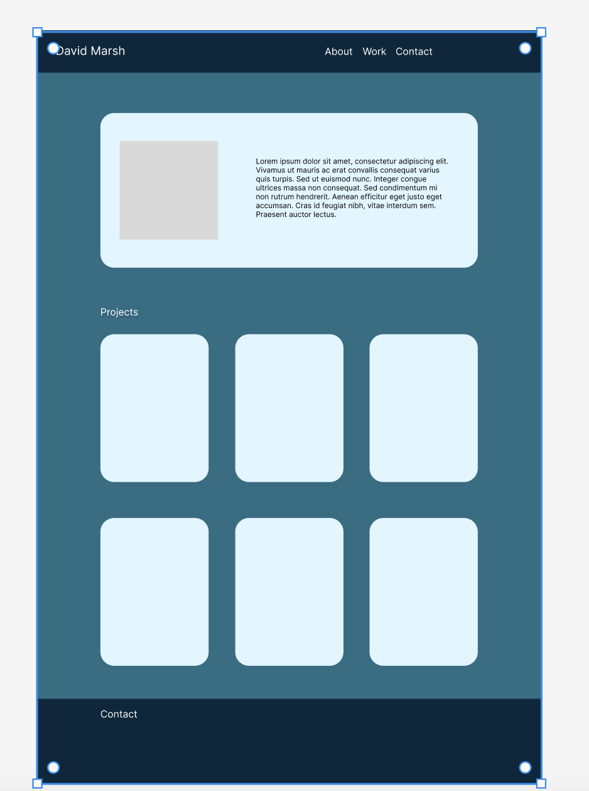

# Bootstrap-Portfolio

I decided to start this project by creating a mockup of how I wanted the paged to look. I used Figma for this.

To create the page I used HTML with Bootstrap and some custom CSS