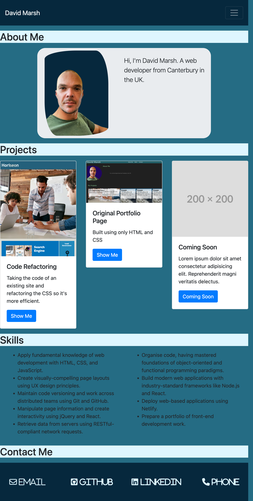

# Bootstrap-Portfolio

https://daveym1.github.io/Bootstrap-Portfolio/

This is my portfolio. It's an ongoing project which I'll add to as I improve my skills and work on more projects.

The portfolio is built using Bootstrap 4 which reduces the need to use media queries to make the page responsive for smaller screen sizes. I also used some custom CSS.

Below is a screenshot of the current page:

---

# Mockup

I decided to start this project by creating a mockup of how I wanted the paged to look. I used Figma for this.

# What I Learned

In learning Bootstrap I can see that it's a good way to build a webpage quickly without the need for multiple media queries to improve responsiveness. However, it does have it's limitations. It does have a certain 'look' and you start to see that webpages built with Bootstrap do look similar.